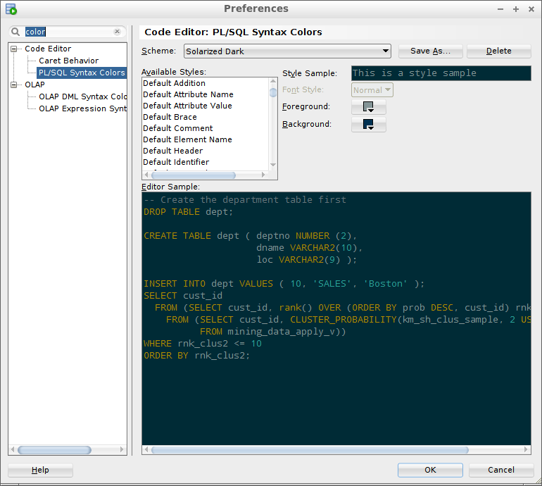
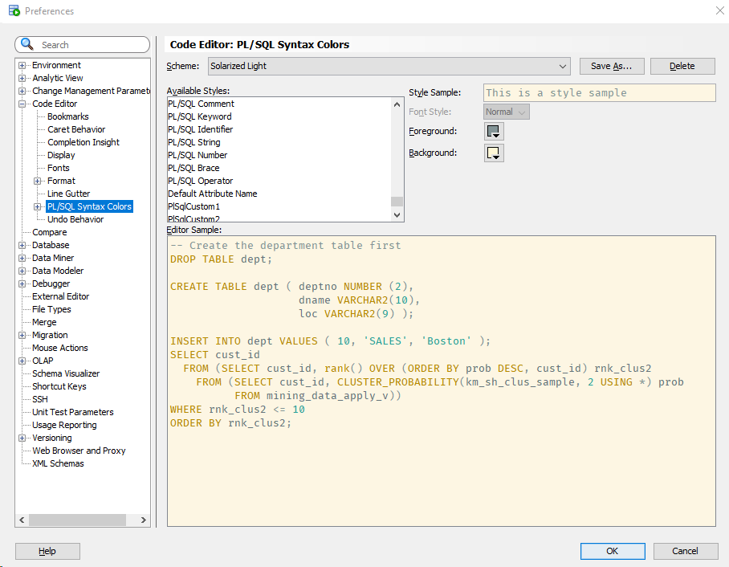

# Solarized Dark color scheme for Oracle SQL Developer #

This is an implementation of the [Solarized Dark](http://ethanschoonover.com/solarized) color scheme for Oracle SQL Developer.  It borrows from ozmoroz's spinoff of the Obsidian colour scheme for Oracle SQL Developer. It is based on [Obsidian Eclipse colour scheme by Morinar](http://eclipsecolorthemes.org/?view=theme&id=21).

## Installation ##

Unfortunately Oracle doesn't make it easy to import a new colour scheme into SQL Developer, thus a little bit of hacking is required.

- Locate file `dtcache.xml` in the SQL Developer's settings directory. On my system it is located in directory `C:\Users\sergey\AppData\Roaming\SQL Developer\system4.0.3.16.84\o.ide.12.1.3.2.41.140908.1359`

- Locate `<schemeMap>` tag inside dtcache.xml file. Insert the content of `solarized-dark-scheme.xml` file inside `<schemeMap>` alongside the other colour schemes. Be careful not to break the XML.

- Launch SQL Developer. Navigate to menu Tools->Preferences, then select item Code Editor -> PL/SQL Syntax Colours in the left pane.

- Select "Solarized Dark" in the "Scheme" drop down list on the top.

## Light theme

Thanks to [smiller6](https://github.com/smiller6) for contributing a light theme.  Follow the same instructions above, but use the file `solarized-light-scheme.xml` instead.

## Tweaks ##

I prefer my background a little darker than the standard one.  To get a darker background, replace all occurrences of `-16766154` with `-16771557` before pasting into your `dtcache.xml` file.
